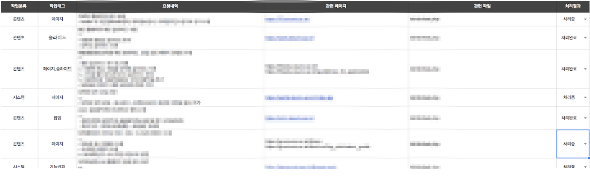
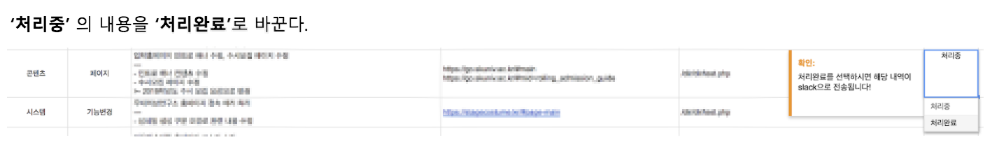
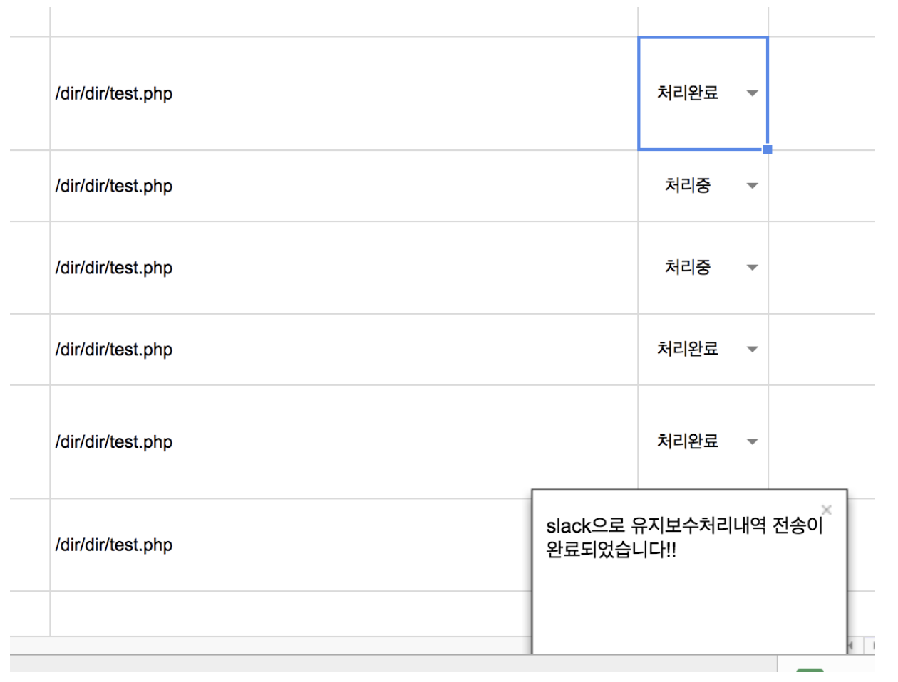
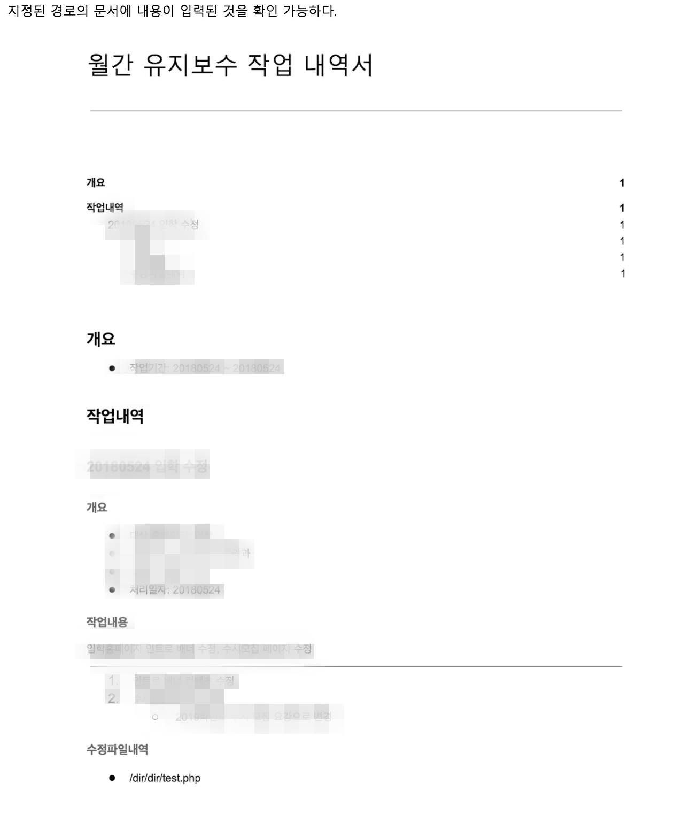

# 스프레드 시트 to 구글문서 자동화 

## About
- 배경
  - 사내 스프레드시트 와 문서 작업으로 이루어지는 유지보수 내역을 작성함에 있어 중복 작업이 있어 업무의 효율을 떨어 뜨리는 문제가 발생
- 시스템 구축 방향
  - google apps script 를 이용한 구현
- 기획의도
   - 스프레드 시트의 유지보수 내역의 항목중 처리결과가 ‘처리 완료' 처리 될 시 해당 내역의 내용이 문서에 동일하게 자동으로 작성되도록 하므로써 업무의 효율을 높힌다.
- 개발방향
 - 스프레드 시트에 접근
 - 스프레드 시트의 목표 시트에 접근
 - 시트의 내용을 데이터로 얻기
 - 얻은 데이터 json형태로 저장
 - trigger 확인
 - 지정 event 발생시 응답 확인
 - 문서에 접근
 - 문서에 쓰기 권한 확인
 - 원하는 형태로 만들기 위한 입력 형태 분석
 - 저장된 json데이터를 문서에 입력 

## Preview
|  |  |
|:---:|:---:|
|  |  |
